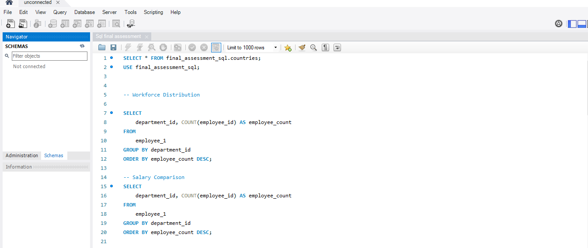

#  Orion Data Systems
## These SQL queries answer multiple business-critical questions and are designed to serve the organization’s objectives. The fact-finding queries were executed on the company’s database, enabling SQL to generate accurate and insightful results for analysis and presentation.

## Executive Summary
- The HR & Strategy team needs insights from their workforce database to support decision-making.
- Each question was carefully answered with the right SQL query which helps generate the desired result from the database.

## The Major Problem
Management requires fact-based data analysis to ascertain key information about the firm’s employees across multiple countries. Several critical questions were addressed through SQL queries executed on the company’s database.

## The Process (Methodology)
### Tools Used:
MySQL, MySQL workbench
### Data Sourcing & Overview
The dataset contains multiple records with various columns capturing detailed information for each staff member across different units of the organization worldwide.

## Recommendations
- I want to recommend that a visual should be prepared from this sql query for ease of visibility.

[Sql file](Matthew_0kunola_sql.sql)
